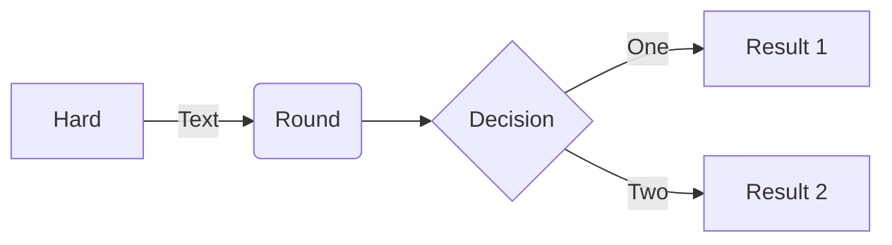

# Interactive Educational Graphics Skills & Resources

Libraries and tools for building interactive diagrams, animated illustrations, scientific/mathematical visualizations, and educational canvas/SVG/WebGL graphics. Use these when a task calls for animated explainer graphics, node-and-arrow diagrams, 3D scenes, or programmatic illustration rather than a plain data chart.

## Best Repositories

### [D3.js](https://github.com/d3/d3)
- **Stars:** ~113,200 (as of 2026-07-13)
- **License:** ISC
- **Last updated:** actively maintained, last push 2026-05-28

D3 (Data-Driven Documents) is the foundational low-level library for binding data to the DOM and driving it with SVG, Canvas, and HTML — it underlies most of the higher-level chart and diagram libraries in this repository.

Best for building fully custom, highly interactive educational diagrams (force-directed graphs, animated transitions, linked-brushing explorable explanations) where off-the-shelf chart types aren't enough.

**Installation:**
```bash
npm install d3
```

**Usage example:**
```html
<script src="https://cdn.jsdelivr.net/npm/d3@7/dist/d3.min.js"></script>
<script>
  d3.select("body")
    .append("svg")
    .attr("width", 200).attr("height", 100)
    .selectAll("circle")
    .data([10, 20, 30])
    .join("circle")
    .attr("cx", (d, i) => i * 60 + 30)
    .attr("cy", 50)
    .attr("r", d => d)
    .attr("fill", "steelblue");
</script>
```

### [Three.js](https://github.com/mrdoob/three.js)
- **Stars:** ~113,700 (as of 2026-07-13)
- **License:** MIT
- **Last updated:** actively maintained, last push 2026-07-13

Three.js is the most widely used cross-browser JavaScript 3D library, wrapping WebGL/WebGPU with a scene-graph API for meshes, materials, lights, and cameras.

Best for interactive 3D educational content — molecule viewers, physics simulations, geometry/math explorables, and immersive (WebXR) science demos.

**Installation:**
```bash
npm install three
```

**Usage example:**
```javascript
import * as THREE from 'three';

const width = window.innerWidth, height = window.innerHeight;
const camera = new THREE.PerspectiveCamera(70, width / height, 0.01, 10);
camera.position.z = 1;

const scene = new THREE.Scene();
const geometry = new THREE.BoxGeometry(0.2, 0.2, 0.2);
const material = new THREE.MeshNormalMaterial();
const mesh = new THREE.Mesh(geometry, material);
scene.add(mesh);

const renderer = new THREE.WebGLRenderer({ antialias: true });
renderer.setSize(width, height);
renderer.setAnimationLoop(animate);
document.body.appendChild(renderer.domElement);

function animate(time) {
  mesh.rotation.x = time / 2000;
  mesh.rotation.y = time / 1000;
  renderer.render(scene, camera);
}
```

### [Mermaid](https://github.com/mermaid-js/mermaid)
- **Stars:** ~89,200 (as of 2026-07-13)
- **License:** MIT
- **Last updated:** actively maintained, last push 2026-07-13

Mermaid generates flowcharts, sequence diagrams, Gantt charts, mind maps, and more from simple Markdown-inspired text definitions, rendered as SVG.

Best for quickly embedding readable, versionable diagrams into documentation, lessons, or explainer content without a design tool — it also renders natively in GitHub/GitLab Markdown.

**Installation:**
```bash
npm install mermaid
```
```html
<script src="https://cdn.jsdelivr.net/npm/mermaid/dist/mermaid.min.js"></script>
```

**Usage example:**


### [Manim (Community Edition)](https://github.com/ManimCommunity/manim)
- **Stars:** ~39,500 (as of 2026-07-13)
- **License:** MIT
- **Last updated:** actively maintained, last push 2026-07-11

Manim is a Python animation engine for precise, programmatic mathematical and scientific animations — this is the actively-maintained community fork of the original engine [3Blue1Brown's manim](https://github.com/3b1b/manim) (~88,400 stars) that powers the 3Blue1Brown math videos.

Best for producing narrated, step-by-step math/physics/CS explainer animations (equation transformations, geometric proofs, graph theory visualizations) rendered to video.

**Installation:**
```bash
pip install manim
```

**Usage example:**
```python
from manim import *

class SquareToCircle(Scene):
    def construct(self):
        circle = Circle()
        square = Square()
        square.flip(RIGHT)
        square.rotate(-3 * TAU / 8)
        circle.set_fill(PINK, opacity=0.5)

        self.play(Create(square))
        self.play(Transform(square, circle))
        self.play(FadeOut(square))
```
```bash
manim -p -ql example.py SquareToCircle
```

### [p5.js](https://github.com/processing/p5.js)
- **Stars:** ~23,800 (as of 2026-07-13)
- **License:** LGPL-2.1
- **Last updated:** actively maintained, last push 2026-07-11

p5.js is a beginner-friendly, client-side JavaScript library based on the Processing language, built specifically to make creative coding and interactive drawing accessible for artists, designers, and students.

Best for classroom-style interactive sketches — generative art, simple physics/animation exercises, and teaching programming fundamentals visually.

**Installation:**
```bash
npm install p5
```
```html
<script src="https://cdnjs.cloudflare.com/ajax/libs/p5.js/1.9.0/p5.min.js"></script>
```

**Usage example:**
```javascript
function setup() {
  createCanvas(400, 400);
}

function draw() {
  background(220);
  ellipse(mouseX, mouseY, 50, 50);
}
```

### [GSAP (GreenSock Animation Platform)](https://github.com/greensock/GSAP)
- **Stars:** ~26,550 (as of 2026-07-13)
- **License:** Custom "no-charge" GreenSock license (free for commercial and personal use, not OSI-approved MIT — see [gsap.com/standard-license](https://gsap.com/standard-license))
- **Last updated:** actively maintained, last push 2026-04-13

GSAP is a high-performance, dependency-free JavaScript animation engine for tweening DOM elements, SVG, and canvas objects, with plugins for scroll-triggered and morphing animations.

Best for smoothly animating educational SVG diagrams and scrollytelling-style explainers where precise timeline control is needed.

**Installation:**
```bash
npm install gsap
```

**Usage example:**
```javascript
import gsap from "gsap";

gsap.to(".box", {
  duration: 2,
  x: 300,
  rotation: 360,
  ease: "power2.inOut"
});
```

### [Konva.js](https://github.com/konvajs/konva)
- **Stars:** ~14,600 (as of 2026-07-13)
- **License:** MIT
- **Last updated:** actively maintained, last push 2026-06-15

Konva extends the HTML5 Canvas 2D context with a retained scene graph, adding drag-and-drop, hit detection, layers, and event handling for interactive canvas graphics (with official React and Vue bindings).

Best for building interactive, draggable educational diagrams (drag-to-label exercises, puzzle/sorting activities, annotation tools) that need canvas performance with DOM-like object interactivity.

**Installation:**
```bash
npm install konva
```

**Usage example:**
```javascript
import Konva from 'konva';

const stage = new Konva.Stage({ container: 'container', width: 400, height: 400 });
const layer = new Konva.Layer();
const circle = new Konva.Circle({
  x: 100, y: 100, radius: 40, fill: 'green', draggable: true
});
layer.add(circle);
stage.add(layer);
```

### [SVG.NET](https://github.com/svg-net/SVG)
- **Stars:** ~1,300 (as of 2026-07-13)
- **License:** MS-PL (Microsoft Public License — permissive, but not one of the common OSI "big three"; review its patent/redistribution terms if bundling commercially)
- **Last updated:** actively maintained community fork; re-check the push date before citing it as current

A C# library for reading, writing, and rendering SVG 1.1 images in .NET applications, targeting .NET Standard 2.0 so it runs on Windows, Linux, and macOS (with some rendering caveats on non-Windows platforms). Originally Microsoft's SVG.NET from CodePlex, now community-maintained.

Best for server-side or desktop .NET workloads that need to parse, manipulate, or rasterize SVG files programmatically — this is the odd one out in this category (backend/.NET rather than browser/JS), reach for it when the other entries here don't apply because you're not in a web frontend.

**Installation:**
```bash
dotnet add package Svg
```

**Usage example:**
```csharp
using Svg;

var document = SvgDocument.Open<SvgDocument>("input.svg");
var bitmap = document.Draw();
bitmap.Save("output.png");
```

## Notes

- **GSAP's license is custom, not MIT/Apache/BSD.** It became free for all use (including commercial) in 2024, but it is a proprietary "no-charge" license, not an OSI-approved open-source license — review the terms if redistribution/forking matters for your use case.
- **p5.js is LGPL-2.1**, a copyleft license (weaker than GPL but distinct from permissive MIT/Apache/BSD licenses) — fine for embedding via script tag/import, but be mindful if statically linking/bundling in some environments.
- **Manim** has two active lineages: the original [3b1b/manim](https://github.com/3b1b/manim) (higher star count, maintained by Grant Sanderson for his own videos, less API-stable) and [ManimCommunity/manim](https://github.com/ManimCommunity/manim) (community-governed, better documented, recommended for most users).

## License Summary

| Repository | License |
|---|---|
| [D3.js](https://github.com/d3/d3) | ISC |
| [Three.js](https://github.com/mrdoob/three.js) | MIT |
| [Mermaid](https://github.com/mermaid-js/mermaid) | MIT |
| [Manim (Community)](https://github.com/ManimCommunity/manim) | MIT |
| [p5.js](https://github.com/processing/p5.js) | LGPL-2.1 |
| [GSAP](https://github.com/greensock/GSAP) | Custom (free, non-OSI GreenSock license) |
| [Konva.js](https://github.com/konvajs/konva) | MIT |
| [SVG.NET](https://github.com/svg-net/SVG) | MS-PL |
